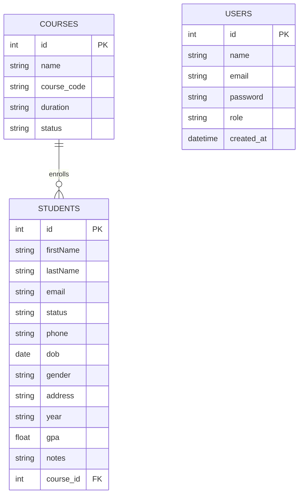

# EduReg — Student Registration Portal

EduReg is a full-stack student registration and academic records platform built for a university registrar's office. It handles student intake, course management, and reporting through a single admin dashboard — with JWT-authenticated access so only registered staff can view or modify records.

Built as a hands-on project to pair backend/API design with cloud deployment practice (Docker, AWS, Terraform).

## Features

**Dashboard**
- Live totals: total/active/graduated students, average GPA
- Recent registrations feed
- Status breakdown (active / inactive / pending / graduated) with pending-action alerts

**Student management**
- Full CRUD — create, edit, view, delete student records
- Search by name, ID, or email; filter by course and status
- Table and grid views, with pagination

**Courses**
- Course catalog pulled live from the database, not hardcoded
- Per-course enrollment counts and average GPA

**Analytics**
- GPA distribution, breakdown by year, gender, and status
- Top performer highlight

**Data export**
- One-click CSV export of the full student roster

**Authentication**
- Email/password login and signup on a single page
- Password hashing with bcrypt
- JWT-based sessions — short-lived access tokens (15 min) with a long-lived refresh token (7 days), so users stay signed in without re-entering credentials
- Dynamic sidebar showing the signed-in user's name, with logout
- `users` table includes a `role` column, laying the groundwork for role-based access control (not yet enforced on routes — see Roadmap)

## Tech stack

| Layer | Technology |
|---|---|
| Backend | Python, Flask |
| Database | MySQL (via `pymysql`) |
| Auth | PyJWT, bcrypt |
| Frontend | Vanilla HTML, CSS, JavaScript (no framework) |
| Planned infra | Docker, AWS (EC2/ECS, RDS, S3 + CloudFront), Terraform, GitHub Actions |

## Database schema



`students.course_id` references `courses.id`. `users` is currently standalone — used only for authentication, not linked to student records.

## Project structure

```
EduReg/
├── controller.py                # Flask routes (students, courses, stats, analytics, auth)
├── model.py                     # Database access layer (MySQL queries)
├── requirements.txt             # Python dependencies
├── run.bat                      # Windows convenience script to start the server
├── env.env                      # Environment variables (DB credentials, JWT secret) — not committed
├── API_FRONTEND_GUIDE.md        # Internal notes on API/frontend contract
├── templates/
│   ├── login_signup.html        # Login / sign-up page
│   └── student_registration_system.html   # Main dashboard app
└── static/
    ├── css/
    │   ├── style.css            # Design system for the dashboard
    │   └── auth.css             # Design system for login/signup
    └── js/
        ├── script.js            # Dashboard logic (routing, rendering, CRUD)
        ├── api-client.js        # Fetch wrapper + API methods (students, courses, auth)
        └── auth.js              # Login/signup form handling
```

## Getting started

**Prerequisites:** Python 3.10+, MySQL server

```bash
git clone https://github.com/<your-username>/EduReg.git
cd EduReg
python -m venv .venv
source .venv/bin/activate        # Windows: .venv\Scripts\activate
pip install -r requirements.txt
```

Create `env.env` in the project root:
```
host=localhost
user=your_mysql_user
password=your_mysql_password
database=eduReg
JWT_SECRET=generate-a-long-random-string
```

Run the app:
```bash
python controller.py
```
On Windows, `run.bat` does the same thing. The dashboard is served at `http://127.0.0.1:5000/`.

## API overview

| Method | Route | Description | Auth required |
|---|---|---|---|
| GET | `/login_signup.html` | Serves the login/signup page | No |
| GET | `/student_registration_system.html` | Serves the main dashboard | No* |
| POST | `/auth/login` | Log in, returns access + refresh tokens | No |
| POST | `/auth/signup` | Create a new account | No |
| POST | `/auth/refresh` | Exchange a refresh token for a new access token | No |
| GET | `/students` | List students (search/filter) | No* |
| GET | `/students/<id>` | Get one student | No* |
| POST | `/students` | Create a student | No* |
| PUT | `/students/<id>` | Update a student | No* |
| DELETE | `/students/<id>` | Delete a student | No* |
| GET | `/courses` | List courses with enrollment stats | No |
| GET | `/stats` | Dashboard summary stats | No |
| GET | `/analytics` | Detailed analytics (GPA distribution, breakdowns) | No |
| GET | `/export/students.csv` | Download full roster as CSV | No |

\* A `require_auth` decorator exists in `controller.py` but is not yet applied to the student CRUD routes — see Roadmap.

## Roadmap

- [x] JWT authentication with silent access-token refresh
- [x] Dynamic sidebar (signed-in user's name) with logout
- [x] CSV export
- [ ] Apply `@require_auth` to student CRUD routes
- [ ] Enforce role-based permissions using the existing `users.role` column
- [ ] Dockerize backend (`Dockerfile` + `docker-compose` for local MySQL)
- [ ] Deploy to AWS (EC2 or ECS, RDS for MySQL, S3 + CloudFront for the frontend)
- [ ] Provision infrastructure with Terraform
- [ ] CI/CD pipeline via GitHub Actions
- [ ] Server-side pagination and sorting

## License

MIT — free to use and adapt.
